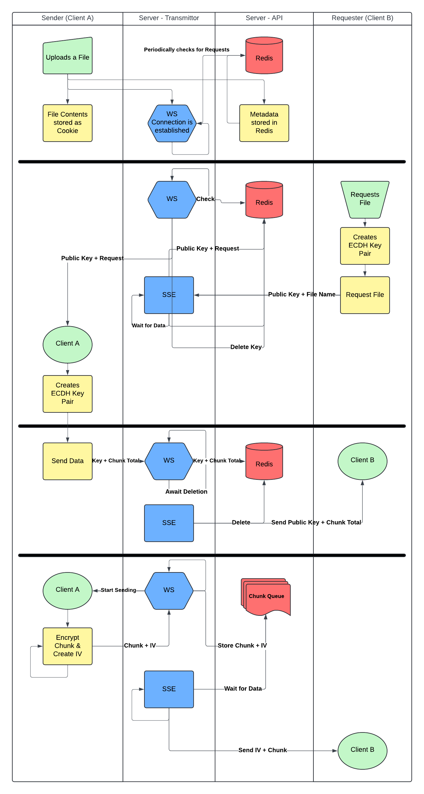

# Drag-n-Share

## Instructions

### Setup

`redis.conf` file in [database](./database/) folder:

```
requirepass "123456"
```

`.env` file in [api](./api/) folder:

```
DATABASE_PASSWORD=123456
JWT_KEY=abc123
```

### Developer Mode

watches for changes

`sudo docker compose --profile dev up`

### Production Mode

Release version containers

`sudo docker compose --profile prod up`

## Explanations

### File Chunk Transmission

When a client "uploads" files, their metadata is being registered on the server.
Its contents are stored in a local cookie to minimize server memory usage.
Also, a websocket connection is being established with the client.
We'll call them "Client A".

The websocket then checks periodically if any file requests have been made.
It does so by searching for the specific Redis entry.

When another client ("Client B") requests a file, it first generates an elliptical ECDH key pair.
It then provides the public key in addition to the file name in the request.

This endpoint method returns a server-sent-envent (SSE).
It first (briefly) stores the public key (together with the filename) of Client B in the DB.

The websocket will register this and send the key to Client A.
Afterwards it deletes the key from Redis.

Client A then starts the chunked file transfer.
It first generates its own ECDH key pair.
It then sends the public key together with the amount of total chunks to the server via the websocket connection.

Meanwhile, the SSE of Client B checked Redis periodically for this information (public key + amount of total chunks) and sends it to Client B.
Once the information is erased from the DB, the websocket requests the encrypted file chunks.
It stores a certain amount of it in a queue and only requests the next one, when the queue isn't full.

The SSE waits for more chunks to be added to the queue, reads and deletes them, and sends them to Client B.

When the last chunk was sent, the SSE is finished.
The WS connection remains open until the client disconnects.

Client B can now decrypt all the chunks, add them together and download them on their local device.

